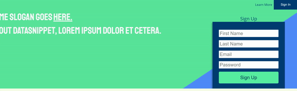

# Pretty-Login


A fun little login/sign up page that uses React's CSSTransition addon to toggle a
pop-up and slide-up of the login and create new user menus.

I enjoyed playing with CSSTransition and React-Transition-Group.

If you want to use this project as a basis:

1. Clone it:

```
git clone
```

2. Install necessary packages.

```
npm install
```

3. Head over to localhost:8080 to see it in action.
